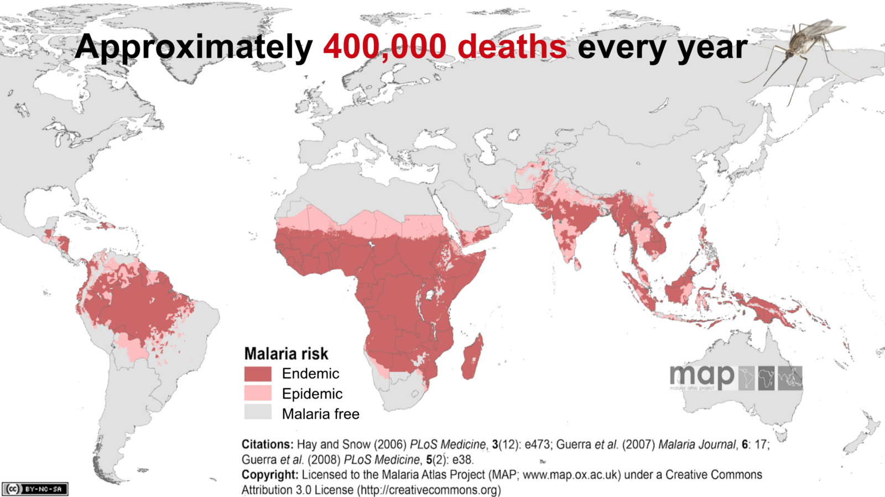

# Malaria-Disease Detection
This repository contains the Jupyter Notebooks to train custom CNNs and extract features from the underlying data using pretrained models applied to the challenge of Malaria Cell classification.

# Impact of Malaria on the World

# Dataset
The segmented cells from the thin blood smear slide images for the parasitized and uninfected classes are made available at https://www.kaggle.com/iarunava/cell-images-for-detecting-malaria. Some of the best quality images from here are selected and uploaded in my repository as Dataset.zip

# Pre-trained convolutional neural networks as feature extractors toward improved malaria parasite detection in thin blood smear images
Malaria is a blood disease caused by the Plasmodium parasites transmitted through the bite of female Anopheles mosquito. Microscopists commonly examine thick and thin blood smears to diagnose disease and compute parasitemia. However, their accuracy depends on smear quality and expertise in classifying and counting parasitized and uninfected cells. Such an examination could be arduous for large-scale diagnoses resulting in poor quality. State-of-the-art image-analysis based computer-aided diagnosis methods using machine learning techniques, applied to microscopic images of the smears using hand-engineered features demand expertise in analyzing morphological, textural, and positional variations of the region of interest. In contrast, Convolutional Neural Networks, a class of deep learning models promise highly scalable and superior results with end-to-end feature extraction and classification. Automated malaria screening using deep learning techniques could, therefore, serve as an effective diagnostic aid. In this study, we evaluate the performance of pre-trained models as feature extractors toward classifying parasitized and uninfected cells to aid in improved disease screening. We experimentally determine the optimal model layers for feature extraction from the underlying data. Statistical validation of the results demonstrates the use of pre-trained convolutional neural networks as a promising tool for feature extraction for this purpose.

